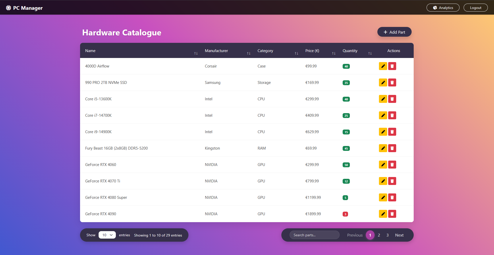
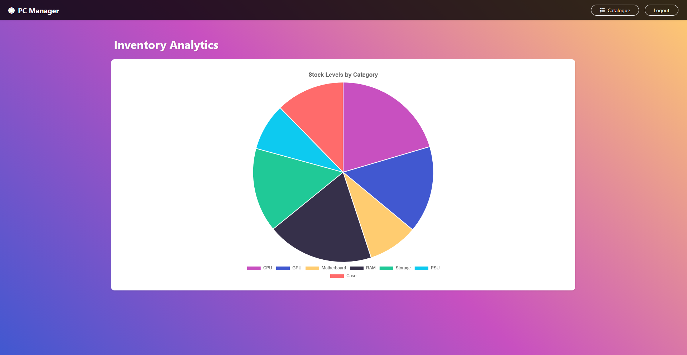
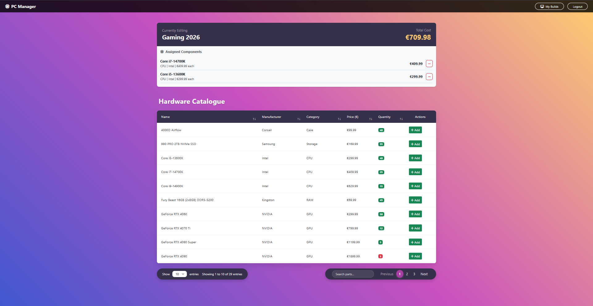

# PC Manager - Full-Stack Web Application

A full-stack web application for managing and planning custom PC configurations. Built with Spring Boot, MySQL, and a JavaScript/jQuery frontend using Bootstrap.

## Tech Stack
* **Backend:** Java 17, Spring Boot 3, Spring Security (JWT), Spring Data JPA
* **Database:** MySQL
* **Frontend:** HTML5, CSS3, JavaScript, jQuery, AJAX
* **UI Libraries:** Bootstrap 5, DataTables, Chart.js, FontAwesome

## Key Features
* **Role-Based Authentication:** Secure JWT login separating Admin and Customer views.
* **Inventory Management:** Full CRUD operations for hardware parts via dynamic modals.
* **Hardware Catalogue:** Searchable, sortable, and paginated data tables.
* **Custom PC Builder:** Add components to custom builds with dynamic total cost calculation.
* **Inventory Analytics:** Interactive Chart.js visualization of current stock levels by category.
* **Robust Validation:** Backend data validation with custom exception handling and user-friendly UI alerts.

## Screenshots


<br><br>

<br><br>


## Prerequisites
Before running this application, ensure you have the following installed:
* **Java 17** (or higher)
* **Maven**
* **MySQL Server** (Running on default port `3306`)

## Database Setup
1. Open your MySQL command line or a GUI like MySQL Workbench.
2. Create an empty database named `pcmanager`:
   ```sql
   CREATE DATABASE IF NOT EXISTS pcmanager;
   ```
3. The application is configured to connect to MySQL using the username `root` and password `root`. If your local MySQL credentials are different, update them in `src/main/resources/application.yml`.
4. The database tables and default hardware data will be automatically generated upon the first application startup.

## Running the Application
1. Open a terminal in the root directory of the project.
2. Build and run the application using the Maven wrapper:
   ```bash
   ./mvnw spring-boot:run
   ```
3. Once the server starts, access the application in your browser at: `http://localhost:8081`

## Default User Accounts
The system automatically generates the following test accounts on startup:
* Administrator: Username: admin | Password: admin
* Standard User: Username: user | Password: user

## API Documentation (Swagger)
This project uses OpenAPI (Swagger) for API documentation. While the server is running, you can explore and test the REST API endpoints here:
**http://localhost:8081/swagger-ui/index.html**

*(Note: To test protected endpoints in Swagger, log in via the UI or the `/api/users/login` endpoint, copy your JWT token, and paste it into the "Authorize" button in the Swagger UI).*